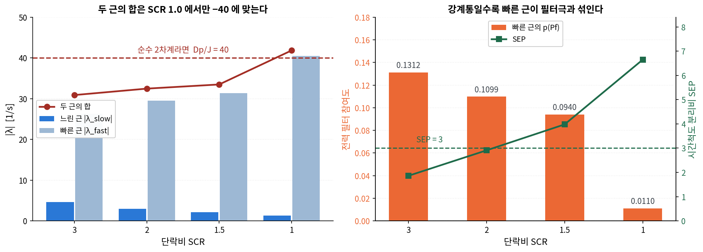

# 스윙극쌍과 전력 필터의 혼합

> **저장 위치:** `01_개념/`

## 한 줄 정의

> 과감쇠된 스윙 모드는 두 실수극으로 갈라진다. 그중 **빠른 근이 강계통에서 전력 필터극과 섞이며**, 이 때문에 `λ ≈ −K/Dp` 근사가 깨진다.

---

## 왜 문제가 되는가

축소 모델은 스윙 방정식을 2차계로 보고 `λ_slow ≈ −K/Dp` 를 쓴다. 이 근사가 성립하려면 두 근이 순수한 스윙 모드여야 한다.

▸ 순수 2차계라면 **두 근의 합이 정확히 `−Dp/J`** 여야 한다. 특성방정식 `Js² + Dps + K = 0` 의 근의 합이 `−Dp/J` 이기 때문이다.
※ 합이 그 값에서 벗어난다면 2차계가 아니라는 직접 증거다.

---

## 실측 (X/R = 1.0, J = 0.5, Dp = 20 → Dp/J = 40)



*그림. 왼쪽은 두 근의 합이 −40 에서 벗어나는 정도, 오른쪽은 빠른 근의 전력 필터 참여도와 시간척도 분리비.*

| SCR | λ_slow | λ_fast | 합 | −40 대비 | p(Pf)@fast | SEP |
|---|---|---|---|---|---|---|
| 3.0 | −4.6445 | −26.2573 | **−30.90** | +23% | 0.1312 | 1.86 ⚠ |
| 2.0 | −2.9653 | −29.5136 | −32.48 | +19% | 0.1099 | 2.91 ⚠ |
| 1.5 | −2.1637 | −31.3347 | −33.50 | +16% | 0.0940 | 3.98 |
| 1.0 | −1.2965 | −40.5415 | **−41.84** | −5% | 0.0110 | 6.65 |

▸ 합이 SCR 1.0 에서만 −40 에 근접한다. 강계통일수록 크게 벗어난다.
▸ 빠른 근의 전력 필터 참여도가 **0.1312 → 0.0110 으로 11.9배 감소**한다.
▸ 시간척도 분리비도 1.86 → 6.65 로 같은 방향이다.
※ 세 지표가 하나의 이야기를 한다. **강계통에서 빠른 근이 필터극과 섞여 있다.**

---

## 왜 강계통에서 섞이는가

전력 필터극은 `−ω_c = −62.8` 근처에 고정돼 있다. 계통 조건과 무관하다.

반면 스윙 빠른 근은 `λ_fast ≈ −Dp/J + K/Dp` 로, K 가 커질수록 −40 에서 멀어진다.

| SCR | K_eff | λ_fast | ω_c 와의 거리 |
|---|---|---|---|
| 3.0 | 2.835e+04 | −26.26 | 36.5 |
| 1.0 | 9.256e+03 | −40.54 | 22.3 |

▸ 강계통에서 K 가 크면 빠른 근이 −26 쪽으로 밀려 올라가고, 그만큼 필터극과 **모드 결합**이 일어난다.
※ 약계통에서는 빠른 근이 −40 근처로 돌아가 필터극에서 멀어지므로 스윙쌍이 순수해진다.

---

## 결과 — Dp 실효값이 달라진다

두 근이 섞이면 스윙 방정식이 보는 실효 감쇠가 `Dp` 그대로가 아니다.

$$\lambda_{slow} \approx -\frac{K}{D_{p,eff}}, \qquad D_{p,eff} \ne D_p$$

▸ 이론 대비 관측 오차 30% 중 **17% 가 여기서 온다.** 나머지 11% 만이 모델–물리 편차다.
※ 분해 근거는 [[동기화계수_K]] 의 "오차 30% 의 분해" 절 참조.

> [!important] 전차수 모델이 필요한 직접 증거
> 축소 모델은 `λ = −K/Dp` 를 전제한다. 전력 필터가 상태변수로 존재하면
> 강계통에서 그 전제가 깨진다. p(Pf) = 0.1312 가 그 정도를 정량화한 값이다.
>
> ※ 필터를 대수식으로 축약한 모델에서는 이 현상이 아예 나타나지 않는다.

---

## PSO 설계에의 함의

> [!success] wc 를 조정 대상에 넣어야 하는 근거
> ω_c 를 바꾸면 필터극 위치가 움직이고, 그에 따라 강계통에서 스윙 빠른 근과의
> 결합 정도가 달라진다. **J·Dp 만으로는 건드릴 수 없는 자유도다.**
>
> ▸ ω_c 를 키우면 필터극이 왼쪽으로 가 스윙쌍에서 멀어진다 → 혼합 감소
> ▸ 다만 전력 측정 잡음이 그대로 통과하므로 상한이 있다
> → [[PSO_목적함수_설계]]

---

## Schur 축소 시 주의

`K_eff` 를 준정상 소거로 뽑을 때 **소거 대상이 충분히 빨라야** 한다.

$$\text{SEP} = \frac{\sigma_{\min}(\text{소거 대상})}{\sigma(\text{동기화 모드})}$$

▸ SEP 가 3 미만이면 가정이 약하다. SCR 3.0(1.86)과 2.0(2.91)이 해당한다.
▸ **그리고 바로 그 두 점이 이론과 가장 어긋난다.** 경고가 판별력을 갖는다는 뜻이다.
※ `sync_reduce.py` 가 SEP 와 판정을 함께 출력한다.

---

## 참여계수를 볼 때의 원칙

> [!warning] 지배 모드 하나만 보면 이 혼합을 놓친다
> 느린 근은 전 구간 순수하다(p(δ+Δω) 0.92~0.98). 그것만 보면 아무 문제가
> 없어 보인다. **빠른 근까지 쌍으로 봐야** 혼합이 드러난다.
>
> ▸ `pf.py` 는 지배 모드 하나를 본다. 확인용으로는 충분하다.
> ▸ `sync_reduce.py` 는 δ·Δω 참여도 상위 **두** 모드를 함께 출력한다.

---

## 관련 코드

```bash
python Simulation/sync_reduce.py      # 두 근, 합, p(Pf), SEP, K_eff
```

출력: `results/<run>/sync_reduction.json`

```python
# 스윙쌍 선택 — 진동 여부를 가리지 않는다
def swing_pair(ev, P, di, wi, n=2):
    keep = [i for i in range(len(ev)) if ev[i].imag >= -IM_TOL]
    pw = P[di, :] + P[wi, :]
    return sorted(keep, key=lambda i: -pw[i])[:n]
```

## 🔗 연결 노트

| 방향 | 노트 | 이유 |
|---|---|---|
| ← | [[동기화계수_K]] | K 의 정의와 오차 분해 |
| ← | [[과감쇠_동기화모드]] | 스윙 모드가 실수극으로 갈라지는 조건 |
| ← | [[참여인자 지배모드]] | 참여계수 계산 방법 |
| → | [[PSO_목적함수_설계]] | wc 조정 근거 |
| → | [[모드교차_최소감쇠비_함정]] | 단일 스칼라 지표의 한계 |
